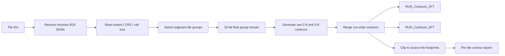

<div align="center">

# HGAC Contour Studio

### Seamless 2-ft and 5-ft contour generation from Houston B24 bare-earth DEMs

A Windows desktop workflow for resolving USGS elevation tiles, building continuous multi-tile surfaces, and generating delivery-ready contours with ArcGIS Pro.


</div>

---

## Overview

**HGAC Contour Studio** is a desktop GUI for generating raw, unsmoothed elevation contours from bare-earth DEMs for the Houston B24 LiDAR project area.

The application accepts one or many LiDAR tile IDs, finds the corresponding USGS bare-earth DEMs, detects adjacent tiles, mosaics connected DEM groups, generates contours from the continuous surface, and writes both run-wide and per-tile outputs to an ArcGIS File Geodatabase.

The v1.4 workflow is specifically designed to reduce artificial contour breaks at shared raster boundaries.

### At a glance

| | |
|---|---|
| **Input** | Tile IDs such as `15RUN316243`, `.las`, or `.laz` names |
| **Elevation source** | USGS Houston B24 bare-earth DEM TIFFs or local DEM fallback |
| **Contour intervals** | 2 ft and 5 ft |
| **Default DEM Z units** | meters |
| **Output units** | international feet |
| **Primary outputs** | `RUN_Contours_2FT` and `RUN_Contours_5FT` |
| **Processing engine** | ArcGIS Pro / `arcpy` |
| **Interface** | Tkinter desktop GUI |

---

## Why seamless multi-tile processing?

Generating contours independently from neighboring raster tiles can produce visible discontinuities at shared tile edges because each contour operation only sees its own raster extent.

HGAC Contour Studio instead:

1. resolves all requested DEMs,
2. identifies spatially adjacent tiles,
3. mosaics each connected group as **32-bit floating point**,
4. generates contours from the continuous group surface,
5. merges the group results into run-wide contour layers, and
6. clips the same continuous contour geometry back to the original tile footprints for tile-level delivery and QA.

This means the run-wide layer is the authoritative continuous product while the individual tile layers remain spatially consistent with it.

---

## Workflow



Non-adjacent selections are processed as separate connected groups, so distant tiles do not create a giant mostly-NoData mosaic.

---

## Key features

- **Simple tile input** — accepts IDs such as `15RUN316243`, `15RUN316243.las`, or `15RUN316243.laz`.
- **USGS DEM discovery** — searches the Houston B24 staged-product download indexes for the matching TIFF.
- **Local fallback** — recursively searches a user-selected root for likely bare-earth DEMs if online retrieval is unavailable.
- **Seam-aware processing** — adjacent DEMs are contoured from one continuous group surface.
- **Two contour products** — creates raw **2-ft** and **5-ft** contour feature classes.
- **Run-wide + tile outputs** — retains both seamless delivery layers and tile-specific QA/delivery layers.
- **Validated attributes** — populates contour elevation, interval, base, type, tile, source, and timestamp fields.
- **No authoritative smoothing** — preserves source terrain geometry rather than cosmetically altering contours.
- **Background execution** — normal launchers suppress ArcGIS worker consoles; a visible troubleshooting launcher is included.
- **QA provenance** — reports and manifests preserve resolved DEM sources and run metadata.

---

## Requirements

- Windows 10 or Windows 11
- ArcGIS Pro 3.x
- ArcGIS Pro Python environment with `arcpy`
- Spatial Analyst **or** 3D Analyst available for contour generation
- Internet access only when using online USGS DEM retrieval

> `arcpy` comes with ArcGIS Pro and is **not** installed through `pip`.

The GUI itself uses Python's standard library and Tkinter.

---

## Quick start

### 1. Clone the repository

```powershell
git clone https://github.com/djoshi1000/hgac-contour-studio.git
cd hgac-contour-studio
```

Or download the repository as a ZIP and extract it on a Windows workstation with ArcGIS Pro installed.

### 2. Check the ArcGIS environment

Run:

```text
check_setup.bat
```

This checks the ArcGIS Pro Python environment and required geoprocessing availability.

### 3. Launch the GUI

Recommended:

```text
launch_hgac_contour_gui.vbs
```

Other launchers:

| Launcher | Use |
|---|---|
| `launch_hgac_contour_gui.vbs` | Recommended silent launch |
| `launch_hgac_contour_gui.bat` | Standard Windows batch launch |
| `launch_hgac_contour_gui_visible.bat` | Troubleshooting with visible console |

### 4. Run contours

1. Paste one or more tile IDs.
2. Choose the DEM source strategy.
3. Select an output folder.
4. Leave DEM vertical units as **meters** unless the source metadata indicates otherwise.
5. Keep the default 2-ft and 5-ft base elevations at `0 ft` unless a different contour sequence is required.
6. Click **RUN SEAMLESS CONTOURS**.

---

## Example tile input

Any of the following resolve to the same tile ID:

```text
15RUN316243
15RUN316243.las
15RUN316243.laz
USGS_OPR_TX_Houston_B24_15RUN316243.tif
```

---

## Output geodatabase

A multi-tile run produces a File Geodatabase similar to:

```text
HGAC_Contours_2FT_5FT.gdb
│
├── RUN_Contours_2FT          ← authoritative 2-ft run-wide product
├── RUN_Contours_5FT          ← authoritative 5-ft run-wide product
├── RUN_Tile_Footprints       ← source tile coverage / provenance
│
├── T_15RUN316243_Contours_2FT
├── T_15RUN316243_Contours_5FT
├── T_<NEXT_TILE>_Contours_2FT
└── T_<NEXT_TILE>_Contours_5FT
```

### Recommended delivery layers

For a complete multi-tile run, use:

```text
RUN_Contours_2FT
RUN_Contours_5FT
```

The `T_<TILE>_...` layers are retained for tile-based delivery, inspection, and QA. They are clipped from the same continuous run-wide contour geometry.

---

## Contour attributes

Generated contour feature classes include fields such as:

| Field | Description |
|---|---|
| `ELEV_FT` | contour elevation in feet |
| `INTERVAL_FT` | contour interval |
| `BASE_FT` | contour base elevation |
| `MAJOR` | index/major contour flag |
| `CONTOUR_TYPE` | contour series/type |
| `TILE_ID` | source tile or batch identifier |
| `SOURCE_DEM` | DEM provenance |
| `SOURCE_URL` | online source when applicable |
| `CREATED_UTC` | creation timestamp |

Run-wide outputs also retain group-level provenance where applicable.

---

## Elevation units

Houston B24 DEM elevations are treated as meters by default and converted to international feet during contour generation using:

```text
Z factor = 3.280839895013123
```

Separate base values are available for the 2-ft and 5-ft contour series.

---

## DEM discovery

The GUI searches the four USGS Houston B24 staged-product indexes:

```text
TX_Houston_1_B24
TX_Houston_2_B24
TX_Houston_3_B24
TX_Houston_4_B24
```

For a tile such as `15RUN316243`, the expected USGS TIFF naming pattern is:

```text
USGS_OPR_TX_Houston_B24_15RUN316243.tif
```

When local fallback is enabled, the application favors paths associated with bare-earth elevation products such as `bare_earth` and `be_rasters` and rejects likely intensity, DSM, CHM, hillshade, slope, and preview products.

---

## Accuracy and processing choices

The workflow intentionally favors preservation of the source elevation surface:

- contours are derived from **bare-earth DEMs**, not DSMs or all-return point clouds;
- adjacent DEM mosaics use **32-bit floating-point** output;
- the mosaic operator is `FIRST` rather than an averaging/smoothing operator;
- no DEM smoothing is applied to the authoritative product;
- no contour smoothing is applied to the authoritative product;
- genuine source NoData is not automatically interpolated;
- tile-specific contour layers are derived from the same run-wide geometry used for delivery.

If a discontinuity remains in a run-wide contour, inspect the source DEM seam and NoData coverage before modifying the vector output.

---

## Project structure

```text
hgac-contour-studio/
│
├── hgac_usgs_contour_gui.py
│   Main Tkinter desktop interface
│
├── hgac_contour_arcgis_batch_worker.py
│   Seamless multi-tile ArcGIS processing worker
│
├── hgac_contour_arcgis_worker.py
│   Single-tile / validation ArcGIS worker
│
├── check_setup.bat
├── launch_hgac_contour_gui.vbs
├── launch_hgac_contour_gui.bat
├── launch_hgac_contour_gui_visible.bat
│
├── test_core.py
├── requirements.txt
│
├── docs/
│   ├── CHANGELOG_v1_1.md
│   ├── CHANGELOG_v1_2.md
│   ├── CHANGELOG_v1_3.md
│   ├── CHANGELOG_v1_4.md
│   └── VALIDATION*.txt
│
├── CONTRIBUTING.md
├── SECURITY.md
└── .gitignore
```

---

## Validation

Lightweight non-ArcGIS tests are provided in:

```text
test_core.py
```

Version-specific validation notes are available under [`docs/`](docs/).

Because ArcGIS geoprocessing depends on a licensed Windows ArcGIS Pro environment, production contour generation should be validated on a representative set of adjacent Houston B24 tiles before customer delivery.

---

## Data and repository hygiene

This repository contains source code only. Downloaded elevation rasters, LAS/LAZ files, File Geodatabases, temporary mosaics, run manifests, and generated contour products are excluded through `.gitignore` and should remain outside source control.

Do not commit customer data, production deliverables, or internal geospatial datasets to this repository.

---

## Version

**Current release: v1.4 — Seamless Multi-Tile Contours**

See [`docs/CHANGELOG_v1_4.md`](docs/CHANGELOG_v1_4.md) for the v1.4 implementation notes.

---

## License and publication

No open-source license is included at this time. Before redistributing or licensing the code, confirm the applicable organizational ownership and publication requirements.

---

<div align="center">

**HGAC Contour Studio · v1.4**  
ArcGIS Pro · Python · USGS Houston B24 elevation data

</div>
